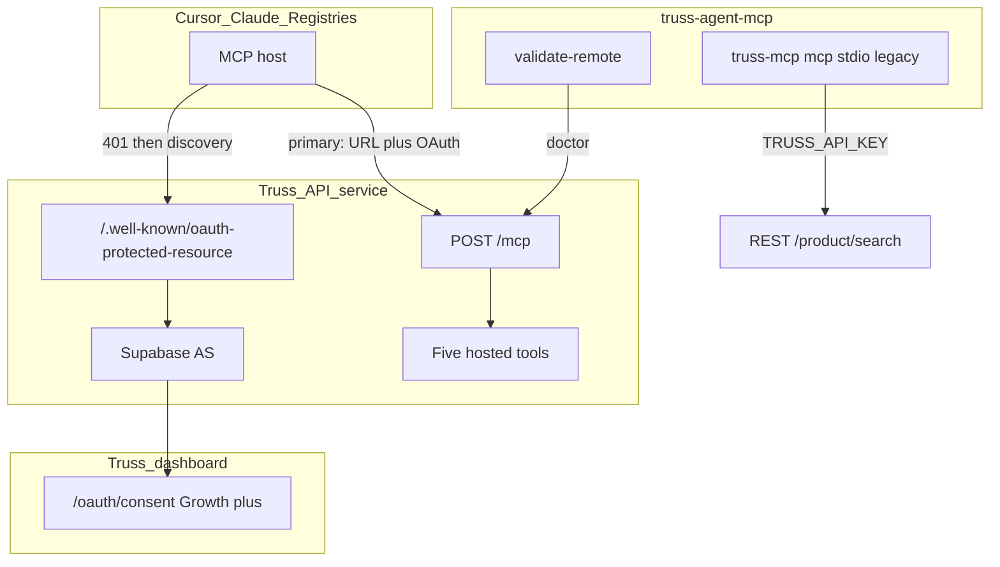
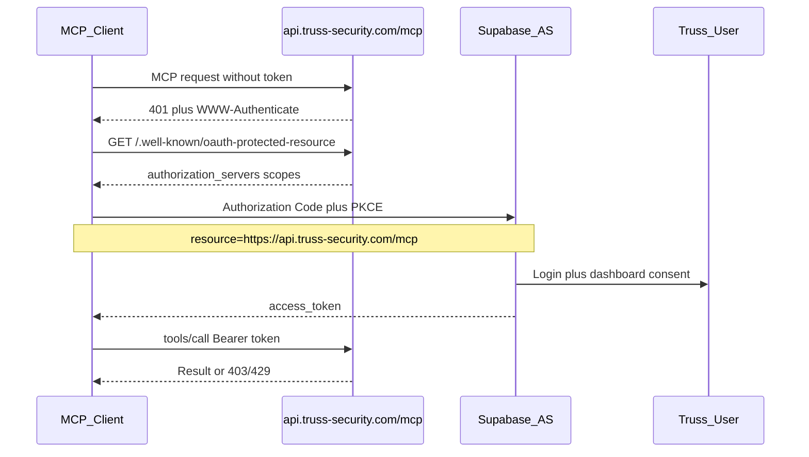

# Hosted Truss MCP — OAuth & subscription tiers

**Status:** Current architecture (deployed)  
**Audience:** Truss engineering, partners, MCP registry maintainers  
**Last updated:** July 2026

---

## Executive summary

Truss exposes a **hosted MCP endpoint** on the API hostname. Cursor, Claude Desktop, and other remote MCP clients connect with **OAuth 2.1 + PKCE**. Growth, Scale, and Enterprise accounts can consent; **Community cannot**.

| Environment | MCP URL | Protected-resource metadata |
|-------------|---------|------------------------------|
| **Production** | `https://api.truss-security.com/mcp` | `https://api.truss-security.com/.well-known/oauth-protected-resource` |
| **Test** | `https://api-test.truss-security.com/mcp` | `https://api-test.truss-security.com/.well-known/oauth-protected-resource` |

**Not MCP:** `https://truss-security.com/mcp` and `https://www.truss-security.com/mcp` serve the marketing site. Do not list those URLs for hosts or registries.

Implementation lives in the **Truss API service** (hosted `/mcp`) and the **Truss dashboard** (`/oauth/consent`). Supabase is the OAuth authorization server. This package (`truss-agent-mcp`) does **not** host that endpoint; it ships:

1. **Remote-first docs and configs** for Cursor / Claude / registries
2. **`truss-mcp validate-remote`** — OAuth + MCP doctor for the hosted URL
3. **Local stdio MCP** (`truss-mcp mcp`) — legacy / air-gap path with `TRUSS_API_KEY` → REST

---

## Two MCP surfaces

| | **Remote (recommended)** | **Local stdio (legacy / air-gap)** |
|--|--------------------------|-------------------------------------|
| **URL / transport** | `https://api.truss-security.com/mcp` (Streamable HTTP) | stdio via `truss-mcp mcp` |
| **Auth** | OAuth Bearer (or `x-api-key` for legacy remote) | `TRUSS_API_KEY` in host env |
| **Who can use** | Growth+ (Community blocked at consent) | Anyone with an eligible API key |
| **Tool set** | **5** hosted tools (source of truth for registries) | **7** FilterQL-oriented tools over REST |
| **Metering** | API Gateway usage plans + MCP eligibility gates | REST quotas via the API key |
| **Owned by** | Truss API + dashboard consent | this npm package |



---

## Hosted tool catalog (registry source of truth)

| Tool | Purpose |
|------|---------|
| `lookup_ioc` | Pivot on one IOC value |
| `search_threats` | Structured product discovery |
| `get_product` | Product detail as JSON |
| `get_product_stix` | Product detail as STIX 2.1 |
| `search_stix` | Search results as STIX 2.1 |
| `get_discord_delivery_setup` | Zapier recipe for scheduled Truss → Discord (no webhook args; does not POST) |

Local stdio tools (`search_products`, `validate_filter_expression`, …) are documented in [04 — Tool catalog](./04-mcp-tool-catalog.md). Registries should advertise this **hosted** catalog.

---

## OAuth flow (Cursor / Claude / partners)



**OAuth `resource` (RFC 8707):** use `https://api.truss-security.com/mcp` (or the matching test URL).

### Tier gate

| Tier | Hosted MCP |
|------|------------|
| **Community** | Denied at OAuth consent |
| **Growth** | Allowed |
| **Scale** | Allowed |
| **Enterprise** | Allowed |

Consent UI: Truss dashboard `/oauth/consent` (`planRank >= growth`).

### Dual auth on `/mcp`

Hosted `/mcp` accepts **`Authorization: Bearer`** (OAuth) **or** **`x-api-key`** (legacy remote / automation). REST and the public SDK remain API-key only.

---

## Partner / registry integration

Partners (SIEM/SOAR, custom agents) must **not** fork this package as their primary integration. They connect to the same hosted URL:

```json
{
  "mcpServers": {
    "truss": {
      "url": "https://api.truss-security.com/mcp"
    }
  }
}
```

Machine-readable listing: [../config/mcp-registry.json](../config/mcp-registry.json).

Validate before publish or certification:

```bash
truss-mcp validate-remote https://api.truss-security.com/mcp --strict-oauth
# or: truss-mcp doctor --remote --strict-oauth
```

---

## Relationship to this package

| Concern | Where |
|---------|--------|
| Hosted server, metering, eligibility | Truss API service |
| OAuth consent UX | Truss dashboard |
| OAuth doctor / CLI / legacy stdio | **truss-agent-mcp** (this repo) |
| Product narrative for in-app assistants | Keep dashboard product docs in sync |

Shared principles: default ~7-day search windows, Community excluded from MCP product access, no API keys in tool arguments.

---

## Security

- Prefer OAuth for interactive hosts so API keys never sit in `mcp.json`
- Tokens are process-local unless the user explicitly `--save-token` for debugging
- Use `maskSecret()` for any credential preview in CLI output
- Report vulnerabilities per [SECURITY.md](../SECURITY.md)

---

## Cross-repo follow-ups

See [06 — Cross-repo OAuth checklist](./06-cross-repo-oauth-checklist.md).

---

## References

- [MCP Authorization (2025-11-25)](https://modelcontextprotocol.io/specification/2025-11-25/basic/authorization)
- [Local server architecture](./01-reference-server-architecture.md)
- [Local tool catalog](./04-mcp-tool-catalog.md)
- [Public API contract](./02-public-api-contract.md)

---

**Prev:** [04 — MCP tool catalog](./04-mcp-tool-catalog.md) · **Next:** [06 — Cross-repo checklist](./06-cross-repo-oauth-checklist.md) · [Docs index](./README.md)
