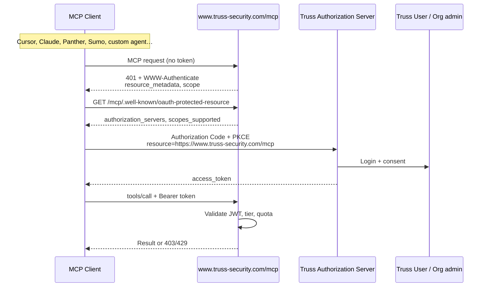
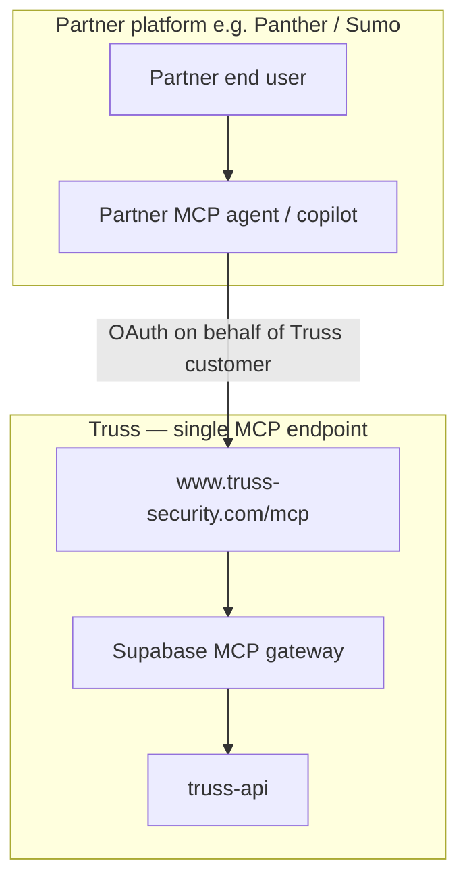
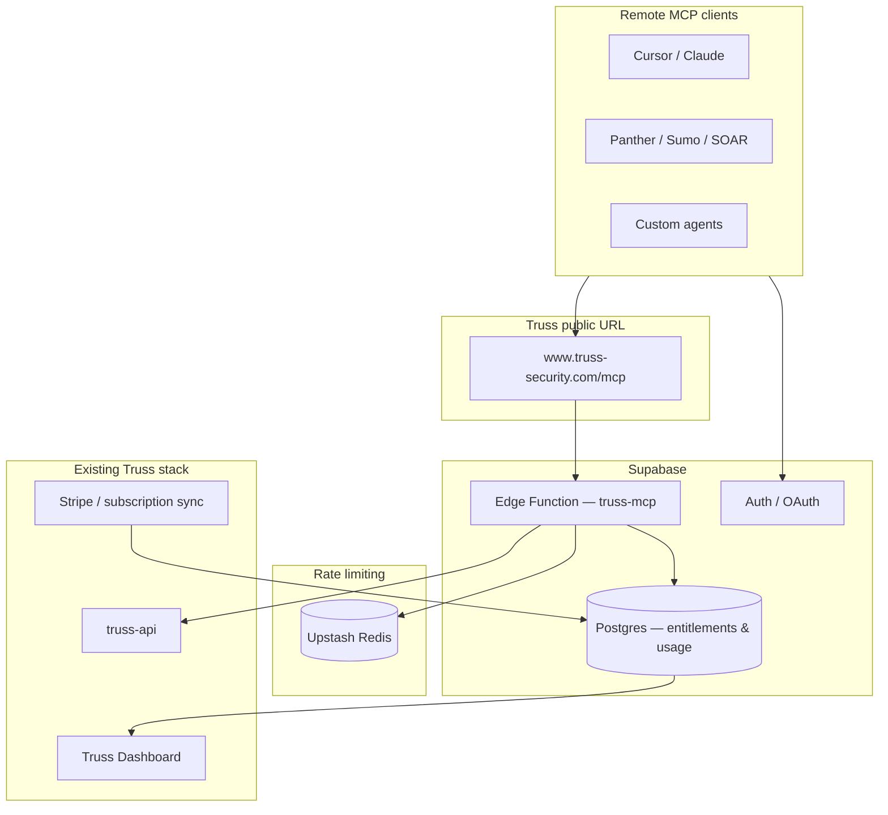

# Hosted Truss MCP — OAuth, Metering & Subscription Tiers

**Status:** Proposal  
**Audience:** Truss leadership & engineering  
**Author:** Truss Security  
**Last updated:** July 2026

---

## Executive summary

Truss already ships a **local MCP server** (`truss-agent-mcp`) that runs on a user's machine and authenticates with an API key. That model works for developers and power users, but it does not give Truss control over **who** uses MCP, **how much** they use it, or **whether usage aligns with subscription tier**.

Modern MCP clients (Cursor, Claude, SIEM/SOAR platforms, custom agents) are moving toward **remote, OAuth-protected MCP servers**. This document proposes a **single canonical hosted Truss MCP endpoint** at **`https://www.truss-security.com/mcp`**, backed by Supabase Edge Functions, that:

1. Authenticates users and integrators via **OAuth 2.1 + PKCE** (industry standard for remote MCP)
2. **Gates access by subscription tier** (Community → Enterprise)
3. **Meters and rate-limits** every tool call for billing, ops, and abuse prevention
4. Reuses the same Truss search/STIX tool surface customers already get from the local MCP package
5. Serves as the **one Truss MCP URL** for all remote clients — including third-party platforms (Panther, Sumo Logic, and others) building their own MCP agents on top of Truss

**Recommendation:** Keep the local npm MCP for self-hosted use. Add **`https://www.truss-security.com/mcp`** as the paid-tier, OAuth-gated product surface. Partners do not run their own Truss MCP servers; they connect **their** agents to **our** endpoint.

---

## Problem statement

| Gap today | Impact |
|-----------|--------|
| API keys live in the user's MCP host config | No per-user audit trail; keys can be shared or leaked |
| Rate limits are API Gateway–only | MCP-specific usage (tool loops, pagination) is invisible to Truss |
| All customer tiers can use local MCP if they have a key | No way to reserve MCP for paid plans |
| stdio transport only | Remote MCP clients expect HTTP + OAuth; we are not in that flow |
| No single canonical remote URL | Partners (SIEM/SOAR) cannot standardize on one Truss MCP integration point |

---

## Canonical endpoint: `https://www.truss-security.com/mcp`

All **remote** MCP access to Truss uses one public URL. The MCP runtime lives on **Supabase Edge Functions**; Truss exposes it under the `truss-security.com` domain for brand trust, TLS, and a stable integration contract.

### URL map

| Public URL | Backend | Purpose |
|------------|---------|---------|
| `https://www.truss-security.com/mcp` | Supabase Edge Function (`truss-mcp`) | Streamable HTTP MCP (tools/list, tools/call) |
| `https://www.truss-security.com/mcp/.well-known/oauth-protected-resource` | Same Edge Function | OAuth Protected Resource Metadata (RFC 9728) |
| `https://www.truss-security.com/mcp/health` | Same Edge Function | Liveness / warmup |

**OAuth `resource` parameter (RFC 8707):** Clients MUST use `https://www.truss-security.com/mcp` as the resource URI during authorization and token exchange.

### Routing (Truss domain → Supabase)


Implementation options (engineering choice):

1. **Reverse proxy** (Cloudflare, API Gateway, or Vercel rewrites) — `www.truss-security.com/mcp/*` → `https://<project-ref>.supabase.co/functions/v1/truss-mcp/*`
2. **Custom domain on Supabase** — attach `mcp.truss-security.com` or path-based routing per Supabase custom-domain support

**Product requirement:** Customers and partners configure **`https://www.truss-security.com/mcp`** in docs and UIs — not the raw `*.supabase.co` URL.

---

## Two MCP models (both are valid)

| | **Local MCP** (today) | **Hosted MCP** (proposed) |
|---|----------------------|---------------------------|
| **Package** | `@truss-security/truss-agent-mcp` | Supabase Edge Function at `www.truss-security.com/mcp` |
| **Endpoint** | Local stdio (no URL) | `https://www.truss-security.com/mcp` |
| **Transport** | stdio (Cursor, Claude Desktop) | HTTP Streamable |
| **Auth** | `TRUSS_API_KEY` in host env | OAuth 2.1 Bearer token |
| **Who can use** | Anyone with an API key | Subscription-gated |
| **Metering** | Truss API usage only | Per-user, per-org, per-tool MCP metering |
| **Best for** | Dev, air-gapped, bring-your-own-key | Growth+ customers, remote clients, SaaS MCP |

The [MCP authorization specification](https://modelcontextprotocol.io/specification/2025-11-25/basic/authorization) explicitly separates these:

- **stdio MCP** → credentials from environment (what we do today)
- **HTTP MCP** → OAuth 2.1 with PKCE, Protected Resource Metadata (RFC 9728), and resource indicators (RFC 8707)

We are not replacing the local server. We are adding the **remote, monetizable** path.

---

## How modern MCP + OAuth works



### What OAuth gives Truss

| Capability | Business value |
|------------|----------------|
| **Per-user identity** | Know exactly who invoked each tool |
| **Per-org billing** | Tie usage to the paying account |
| **Tier enforcement** | Community blocked; Growth limited; Enterprise unlimited |
| **Revocation** | Disable MCP for an org without rotating API keys |
| **Audit trail** | Compliance, support, and abuse investigation |
| **Scoped access** | e.g. STIX export only on Scale+ |

### Proposed OAuth scopes

| Scope | Tools covered |
|-------|---------------|
| `mcp:tools:search` | `search_products`, `validate_filter_expression`, `list_filter_attributes` |
| `mcp:tools:paginate` | `search_products_page`, `iterate_products_summary` |
| `mcp:tools:stix` | `search_products_stix`, `get_product_stix` |
| `mcp:quota:read` | Future quota visibility tool |

---

## Third-party MCP agents (SIEM, SOAR, security platforms)

Partners such as **Panther**, **Sumo Logic**, **Torq**, **Tines**, or other vendors may ship **their own MCP agents** (orchestration UIs, investigation copilots, automated playbooks) that need Truss threat intelligence. Those agents should **not** embed or fork `truss-agent-mcp`. They connect to the **same hosted endpoint** as Cursor and Claude:

```
https://www.truss-security.com/mcp
```

### Integration model



| Principle | Detail |
|-----------|--------|
| **One Truss MCP URL** | All remote integrations use `https://www.truss-security.com/mcp` |
| **Partner builds the agent** | Partner owns UX, prompts, and workflow; Truss owns data + tools |
| **Customer authorizes Truss** | OAuth consent ties the session to the **customer's Truss org** and subscription tier |
| **Same tools, same limits** | `search_products`, STIX tools, etc. — tier limits apply per org, not per partner |
| **Metering attributes usage** | Usage events record `client_id` / `integrator` (e.g. `panther`, `sumo`) for analytics and partner reporting |

### Partner onboarding (proposed)

1. **Register OAuth client** — Partner receives a `client_id` (Client ID Metadata Document or approved DCR per MCP spec).
2. **Document the endpoint** — Partner docs list `https://www.truss-security.com/mcp` and required scopes.
3. **Customer connects** — End user logs into Truss via OAuth; partner never sees the Truss API key.
4. **Certification (optional)** — Truss verifies Streamable HTTP, PKCE, `resource` parameter, and error handling before listing in an integrator directory.

### Example partner MCP config (illustrative)

```json
{
  "mcpServers": {
    "truss": {
      "url": "https://www.truss-security.com/mcp",
      "auth": {
        "type": "oauth2",
        "resource": "https://www.truss-security.com/mcp"
      }
    }
  }
}
```

Partners that today integrate via **REST + API key** can continue to use the Truss API directly. **MCP** is the standard path for **AI-native** agents (tool calling, LLM orchestration) — one endpoint for all of them.

### Why not let partners self-host Truss MCP?

| Self-hosted by partner | Hosted at `www.truss-security.com/mcp` |
|------------------------|----------------------------------------|
| Partner holds customer API keys | Keys stay in Truss/Supabase vault |
| No tier enforcement | Subscription gates enforced |
| Fragmented versions | One tool catalog, one upgrade path |
| No integrator metering | Per-partner usage analytics |

---
## Proposed architecture (Supabase behind `www.truss-security.com/mcp`)



### Component responsibilities

| Component | Role |
|-----------|------|
| **`www.truss-security.com/mcp`** | Public URL; TLS and path routing to Supabase (customers never configure `*.supabase.co`) |
| **MCP Edge Function** | Runs Streamable HTTP MCP; exposes the same 7 tools as today |
| **Supabase Auth** | Login, consent screen, JWT issuance (or bridge to existing Truss IdP) |
| **Postgres** | Org tier, monthly usage counters, per-call audit log, `integrator` / `client_id` |
| **Upstash Redis** | Real-time rate limits (requests/minute, burst, concurrency) |
| **Truss API** | Data plane — gateway calls with **server-side** org API key (never exposed to client) |
| **Dashboard** | Customer-facing MCP usage & quota view |

**Important:** The customer's API key never leaves Truss infrastructure. The MCP client only holds an OAuth token.

---

## Subscription tier policy

| Tier | MCP access | Proposed limits | Notes |
|------|------------|-----------------|-------|
| **Community** | **None** | 0 tool calls | 403 at gateway with upgrade message |
| **Growth** | Limited | ~500 tool calls/month, 10 req/min, 1 concurrent session | STIX tools disabled |
| **Scale** | High availability | ~25k tool calls/month, 60 req/min, 5 concurrent sessions | Full tool set incl. STIX |
| **Enterprise** | Unlimited* | Abuse guardrails only (~300 RPM soft cap) | Full audit export, custom limits negotiable |

\*Enterprise still needs fair-use protection — LLM agents can loop tools and burn API quota rapidly.

### Enforcement pipeline (every request)

1. Validate OAuth JWT (signature, audience, expiry)
2. Resolve `org_id` and `subscription_tier`
3. **Community** → reject immediately (`403 mcp/forbidden`)
4. Check monthly tool-call budget (Postgres)
5. Check real-time rate limit (Redis)
6. Check per-tool tier allow-list (e.g. STIX requires Scale+)
7. Execute tool → call Truss API with org's server-side key
8. Log usage event (tool name, latency, result count, status)
9. Return result, or `429` with `Retry-After` and quota headers

---

## Data model (sketch)

```sql
-- Billing sync (Stripe → Supabase)
organizations (
  id, name,
  subscription_tier,  -- community | growth | scale | enterprise
  truss_api_key_secret_id  -- vault reference, not plaintext
)

-- Per-call audit (ops, support, enterprise compliance)
mcp_usage_events (
  org_id, user_id, tool_name,
  oauth_client_id, integrator,  -- e.g. panther, sumo, cursor
  truss_api_calls, result_count, latency_ms, status, created_at
)

-- Monthly rollup (billing & dashboard)
mcp_monthly_usage (
  org_id, month, tool_calls, truss_api_calls
)

-- Configurable limits (no hardcoded tier logic in code)
mcp_tier_limits (
  tier, monthly_tool_calls, requests_per_minute,
  max_concurrent_sessions, max_iterate_pages, stix_enabled
)
```

Example tier config:

| Tier | Monthly calls | RPM | Concurrent | STIX |
|------|---------------|-----|------------|------|
| Community | 0 | 0 | 0 | No |
| Growth | 500 | 10 | 1 | No |
| Scale | 25,000 | 60 | 5 | Yes |
| Enterprise | ∞ | 300 | 50 | Yes |

Limits are **starting points** — tune with real usage data after launch.

---

## Monitoring & customer visibility

### Internal (Truss ops)

- Tool-call volume by tier, org, and tool
- 429/403 rates (quota exhaustion vs entitlement blocks)
- P95 latency gateway → Truss API
- Anomaly detection (sudden spikes, iterate loops)

### Customer-facing (Dashboard)

- MCP usage this month vs plan limit
- Top tools used
- Quota warning at 80% / 100%
- Upgrade CTA for Community users who hit the hosted endpoint

### Optional: metered billing

Monthly `mcp_monthly_usage` rollups can feed Stripe metered billing if MCP becomes a distinct revenue line (vs bundled in Scale/Enterprise).

---

## Relationship to `truss-agent-mcp` (this repo)

| | Local MCP (this repo) | Hosted MCP (new) |
|---|----------------------|------------------|
| Distribution | npm package | `https://www.truss-security.com/mcp` (Supabase backend) |
| Auth | Env API key | OAuth |
| Tier gating | No | Yes |
| Code reuse | Source of truth for tool logic | Import shared tool package |

**Engineering approach:** Extract shared tool handlers (`schemas`, FilterQL validation, payload builder, product summaries) into an internal package consumed by both the stdio server and the Edge gateway. Avoid duplicating the seven-tool catalog.

---

## Implementation phases

### Phase 0 — Foundation (2–3 weeks)

- Supabase Edge Function with Streamable HTTP MCP
- **`www.truss-security.com/mcp`** routed to Supabase (proxy or custom domain)
- OAuth discovery at `/mcp/.well-known/oauth-protected-resource`
- OAuth wired to Truss dashboard login
- Org tier synced from billing
- Community hard-block with clear upgrade path

### Phase 1 — Growth tier (2 weeks)

- Redis rate limiting + monthly counters
- Usage events → dashboard widget
- Tool parity with local MCP (7 tools)

### Phase 2 — Scale (1–2 weeks)

- STIX tool gating (Scale+ only)
- Higher RPM and concurrency pools
- Quota warning emails

### Phase 3 — Enterprise (ongoing)

- Audit log export
- Per-contract custom limits
- Optional dedicated subdomain (e.g. `acme.truss-security.com/mcp`) — default remains `www.truss-security.com/mcp` for all standard integrations

---

## Security considerations

- API keys stay server-side (Supabase Vault or equivalent); MCP clients never see them
- OAuth tokens are audience-restricted to `https://www.truss-security.com/mcp`
- Usage logs record tool metadata, not filter content (unless Enterprise audit requires more)
- Row-level security on Postgres — orgs see only their own usage
- Community tier blocked at gateway, not merely throttled at API Gateway

---

## Open decisions for discussion

1. **Pricing:** Is MCP bundled into Growth/Scale/Enterprise, or a metered add-on?
2. **Community local MCP:** Do we continue allowing self-hosted stdio MCP with an API key for Community, while blocking only the **hosted** endpoint?
3. **IdP:** Supabase Auth natively, or bridge to existing Truss auth?
4. **Launch clients:** Which remote MCP clients do we certify first (Cursor remote, Claude, Panther, Sumo, other)?
5. **Partner program:** Formal OAuth client registration and integrator directory for SIEM/SOAR vendors?
6. **Routing:** Cloudflare/API Gateway rewrite vs Supabase custom domain for `/mcp`?
7. **Limit numbers:** Are the proposed Growth/Scale caps directionally right for unit economics?

---

## Recommendation

| Action | Rationale |
|--------|-----------|
| **Single URL: `www.truss-security.com/mcp`** | One integration point for Cursor, partners, and custom agents |
| **Supabase as runtime, Truss domain as contract** | Ops on Edge Functions; customers see only truss-security.com |
| **Proceed with hosted MCP on Supabase** | Industry direction; enables tier gating and metering |
| **Keep local `truss-agent-mcp`** | Serves devs, air-gapped, and BYO-key workflows |
| **Partners use hosted endpoint, not a fork** | Panther/Sumo/etc. build agents; Truss owns MCP + data plane |
| **Gate Community from hosted MCP** | Clear upgrade lever; OAuth makes enforcement clean |
| **Reuse tool logic, don't rewrite** | Faster time-to-market; consistent behavior |
| **Start with Growth limits, iterate** | Ship metering first; tune caps from real data |

---

## References

- [MCP Authorization (2025-11-25)](https://modelcontextprotocol.io/specification/2025-11-25/basic/authorization)
- [Supabase: Deploy MCP servers](https://supabase.com/docs/guides/ai-tools/byo-mcp)
- [Supabase: Rate limiting Edge Functions](https://supabase.com/docs/guides/functions/examples/rate-limiting)
- [Truss MCP tool catalog](./04-mcp-tool-catalog.md)
- [Truss public API contract](./02-public-api-contract.md)
- [Local server architecture](./01-reference-server-architecture.md)
- [SECURITY.md](../SECURITY.md) — credential handling principles

---

**Prev:** [04 — MCP tool catalog](./04-mcp-tool-catalog.md) · [Docs index](./README.md)

*Questions or feedback: discuss in Truss engineering / product sync.*
