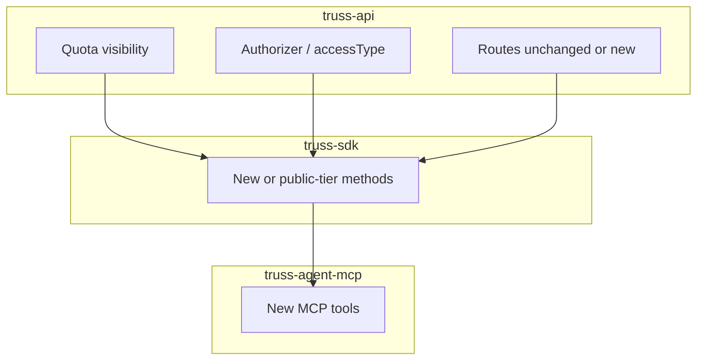

# Truss API roadmap (planned)

This document describes **planned** Truss API and SDK capabilities—not yet available in **truss-agent-mcp v1**. Dates are not committed; items ship when the underlying API and SDK work is complete.

**Today (v1):** FilterQL search and STIX on the public customer tier. See [02-public-api-contract.md](./02-public-api-contract.md) and [04-mcp-tool-catalog.md](./04-mcp-tool-catalog.md).

## Dependency flow

| Phase | Owner | Deliverable |
|-------|--------|-------------|
| 1 | [truss-api](https://github.com/truss-security/truss-api) | Quota visibility API or headers; contributor `POST /product` auth |
| 2 | [@truss-security/truss-sdk](https://www.npmjs.com/package/@truss-security/truss-sdk) | Typed clients; OpenAPI updates in [truss-docs](https://truss-security.github.io/truss-docs/data/sdk) |
| 3 | truss-agent-mcp | New MCP tools, catalog, and server instructions |

---

## 1. API quota visibility

### Today

- Limits are enforced by **AWS API Gateway usage plans** (throttle + quota). Clients typically discover limits only after a **429** response.
- There is no standard **`X-RateLimit-*`** header or dedicated “quota remaining” endpoint exposed to integrators today.

### Planned (truss-api)

Operational work in **truss-api** / API Gateway:

- Surface **remaining quota** and plan identity (e.g. community, user, contributor) via one or more of:
  - Response headers on existing routes
  - A small read-only route (e.g. usage summary for the authenticated API key)
  - Integration with API Gateway usage-plan / key usage APIs

Aligns with transparency goals in [truss-api usage-plans documentation](https://github.com/truss-security/truss-api/blob/main/docs/api-client-usage-plans-and-operator-costs.md).

### Planned (SDK)

- Optional **`client.usage`** (or header parsing on `HttpClient`) so scripts and agents can read `limit`, `remaining`, and reset window without custom HTTP.

### Planned (truss-agent-mcp)

| Future tool | Purpose |
|-------------|---------|
| `get_api_quota` | Return `{ plan, limit, remaining, resetAt }` (exact shape TBD by API) |
| Improved 429 messages | Include quota hint when the API provides it |

Optional: MCP **resource** for static quota status readable by the host.

---

## 2. Contributor POST of products

### Today

- `POST /product` (and related write routes) exist in the API but are **not** on the customer `endpointAccess` allow-list in `apiAuthorize`—only **admin**-tagged keys can create products.
- **Contributor** usage plans today differ mainly in **rate/quota** ([usage plans doc](https://github.com/truss-security/truss-api/blob/main/docs/api-client-usage-plans-and-operator-costs.md)), not write scope.

### Planned (truss-api)

- Extend authorizer rules so **contributor** (or a dedicated `accessType`) may call **`POST /product`** (and batch create if applicable).
- Document payload schema, validation, and contributor ToS in truss-docs / OpenAPI.

### Planned (SDK)

- Typed **`products.create(...)`** (namespace TBD) wrapping `POST /product`.

### Planned (truss-agent-mcp)

| Future tool | Purpose |
|-------------|---------|
| `create_product` | Submit a product with strict schema validation |

**Not enabled in MCP until the API ships.** Documentation will cover safety expectations (no credential or PII leakage in tool args).

---

## 3. Similarity and smart search (customer tier)

### Today

- **SDK** already implements `search.smart`, `search.vector`, `search.global`, and `search.similar`.
- **Authorizer** restricts `/search/smart`, `/search/vector`, `/search/global`, and `/search/similar/{id}` to **admin** keys—customer keys receive **403** if they call these routes.
- **truss-agent-mcp v1** does not expose these tools; the host LLM builds **FilterQL** instead.

### Planned (truss-api)

- New or extended **`accessType`** (e.g. `ai`) or tiered allow-list so eligible customer keys can use some or all AI search routes—without granting full admin (writes, analytics, `pg-query`, etc.).

### Planned (SDK)

- Mark methods as **public-tier** in docs when auth opens; no breaking change to method signatures expected.

### Planned (truss-agent-mcp)

| Future tool | SDK mapping |
|-------------|-------------|
| `search_products_smart` | `search.smart` |
| `search_products_vector` | `search.vector` |
| `search_products_global` | `search.global` (if exposed) |
| `find_similar_products` | `search.similar` |

Server **instructions** will be updated when these tools ship so hosts know when FilterQL vs smart/vector search is appropriate.

---

## 4. Singular product fetch by ID (native JSON)

### Today

- **`GET /product/{id}`** returns native Truss JSON but is **admin-only** at the authorizer.
- Public SDK exposes **`productStix(id)`** (`GET /product/{id}/stix`) only—not native JSON GET.
- MCP v1: **`get_product_stix`** only.

### Planned (truss-api)

- Allow **`GET /product/{id}`** for customer or professional-tier keys (exact `accessType` TBD).

### Planned (SDK)

- New method such as **`search.product(id)`** or **`products.get(id)`** wrapping `GET /product/{id}`.

### Planned (truss-agent-mcp)

| Future tool | Purpose |
|-------------|---------|
| `get_product` | Trimmed native JSON summary (same shaping as `search_products`; optional `include_indicators`) |

Complements existing **`get_product_stix`** for SOAR/STIX workflows.

---

## Summary table

| Capability | Today | truss-api | SDK | MCP (future) |
|------------|-------|-----------|-----|--------------|
| Quota visibility | 429 only | Usage-plan / header / route work | `usage` or headers | `get_api_quota` |
| Contributor POST | Admin only | Authorizer + docs | `products.create` | `create_product` |
| Smart / similar search | Admin only; SDK exists | `accessType` expansion | Public-tier docs | `search_*_smart`, `find_similar_products`, etc. |
| Product GET by id (JSON) | Admin only; STIX in SDK/MCP | Authorizer | `product(id)` | `get_product` |

---

## Related reading

- [02-public-api-contract.md](./02-public-api-contract.md) — v1 allowed routes
- [04-mcp-tool-catalog.md](./04-mcp-tool-catalog.md) — v1 and planned tools
- [01-vision.md](./01-vision.md) — why v1 uses FilterQL first
