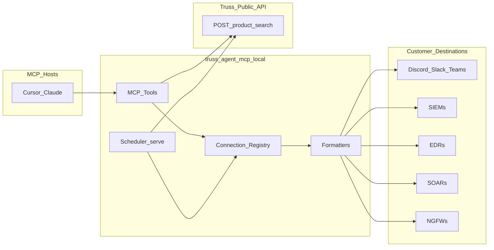
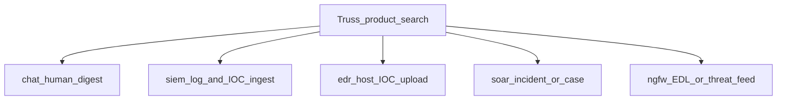
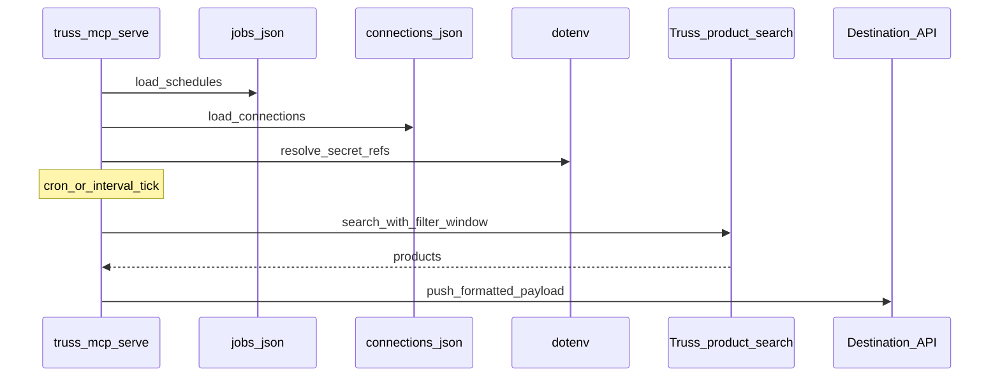

# Unified agent delivery architecture

Architectural plan for merging **truss-agent** (scheduled query + destination push) into **truss-agent-mcp** so a single local agent can investigate via MCP tools, manage connections and jobs, push products to chat/SIEM/EDR/SOAR endpoints, and run scheduled queries—while keeping the hosted MCP surface query-only and respecting the public API boundary.

This document is a design plan. Implementation follows the phased roadmap in [§10](#10-phased-implementation-roadmap).

**Related:** [01 — Local stdio](./01-reference-server-architecture.md) · [02 — Public API](./02-public-api-contract.md) · [04 — Tool catalog](./04-mcp-tool-catalog.md) · [05 — Hosted MCP](./05-hosted-mcp-oauth-architecture.md) · [guides/truss-agent-vs-mcp.md](../guides/truss-agent-vs-mcp.md)

---

## 1. Goals and non-goals

### Goals

1. **One local agent** — Absorb truss-agent capabilities into this package so operators do not need a separate process for schedule + push.
2. **MCP control plane** — From Cursor/Claude (local stdio), create/update connections and jobs, run queries, and push results to named destinations.
3. **Scheduled delivery** — Cron or interval jobs that pull via public product search and push formatted output to configured endpoints.
4. **Env-backed secrets** — Store URLs, tokens, and API keys in `.env`; connections reference env var *names*, never raw secrets in JSON or tool args.
5. **Native destination matrix** — Out-of-the-box adapters for chat, SIEM, EDR, SOAR, and NGFW (see [§6](#6-destination-matrix)).
6. **Public API boundary** — Enrichment remains `POST /product/search`, `POST /product/search/stix`, `GET /product/{id}/stix` only. Push is customer egress.

### Non-goals

- Hosted MCP (`https://api.truss-security.com/mcp`) will **not** hold customer webhook URLs or SIEM/EDR/SOAR credentials, and will **not** push to customer infra.
- No MCP tools that call Truss admin routes (`/search/smart`, `/search/vector`, writes, `pg-query`, etc.).
- No `/agent-data` MCP tools; named filters live in local `jobs.json` / `connections.json`.
- LLM detection-rule *generation* (existing CLI guide) is not the same as deploying rules to a SIEM/SOAR until an adapter implements `create_detection_rule`.
- Do not resurrect the legacy Splunk SDK path from truss-agent as-is; Splunk ingest is **HEC-first**.

---

## 2. Current state vs target state

### Today

| Concern | Owner |
|---------|--------|
| Interactive FilterQL / STIX / investigation | **truss-agent-mcp** (stdio tools + hosted MCP + `search` REPL) |
| Cron / interval schedules | **truss-agent** (`QueryManager`, `node-cron` / `setInterval`) |
| Discord / Slack / MS Teams push | **truss-agent** (`src/connections/*`) |
| SIEM / EDR / SOAR push | Missing or stub (e.g. unused Splunk adapter) |
| Secrets | Agent: `TRUSS_API_KEY` in `.env`; webhooks often inline in `connections.json` |

Operators must explore in MCP, then manually copy filters into truss-agent jobs ([guides/truss-agent-vs-mcp.md](../guides/truss-agent-vs-mcp.md)).

### Target

| Concern | Owner |
|---------|--------|
| Investigation + connection/job/push tools | **Local** `truss-mcp mcp` |
| Headless scheduler | **Local** `truss-mcp serve` (same config store) |
| Hosted MCP | Investigation only (existing five tools) |
| Destination adapters | Pluggable registry in this package (chat + SIEM + EDR + SOAR + NGFW) |
| Secrets | `.env` only; config JSON holds env refs |



---

## 3. Runtime surfaces

| Surface | Role after merge |
|---------|------------------|
| **Hosted MCP** | Query / IOC / STIX investigation only. No connection, job, or push tools. |
| **Local `truss-mcp mcp`** | Existing seven FilterQL/STIX tools **plus** connection, job, and delivery tools. Requires `TRUSS_API_KEY` and local config dir. |
| **`truss-mcp serve`** | Long-running daemon: load jobs, schedule pulls, push to enabled connections. Same `.env` + `config/` as stdio. |
| **`truss-mcp search`** | Interactive REPL; can coach filters and (via tools) create jobs/connections. |
| **`truss-mcp init` / `doctor`** | Extend to validate destination env refs and config schema (in addition to Truss key checks). |

Hosted vs local remains intentional: partners and Cursor OAuth users keep a thin investigation surface; customers who need delivery run the local package with their own secrets and egress.

---

## 4. Config and secrets layout

### 4.1 Bundle (per local environment)

| Artifact | Role | Secrets? |
|----------|------|----------|
| `.env` (or `~/.config/truss/env`, `~/.truss/.env`) | `TRUSS_API_KEY`, destination URLs/tokens/keys | Yes |
| `config/agent.json` | Display name / agent identity | No |
| `config/connections.json` | Named destinations: type, enabled, query, **env ref fields** | No (refs only) |
| `config/jobs.json` | Schedule, outputFormat, connectionName, filter/window | No |

Load order for env remains existing MCP behavior: shell env wins; then user config paths; then `./.env` overrides user files ([`src/lib/load-dotenv.ts`](../src/lib/load-dotenv.ts)).

Path overrides (compatible with truss-agent):

| Variable | Default |
|----------|---------|
| `JOBS_FILE` | `config/jobs.json` |
| `CONNECTIONS_FILE` | `config/connections.json` |
| `AGENT_CONFIG_FILE` | `config/agent.json` |

### 4.2 Env-ref pattern

Connections **must not** store raw webhook URLs or API tokens. They store the **name** of the environment variable that holds the secret.

**Chat (Discord) example — connections.json:**

```json
{
  "connections": [
    {
      "name": "discord-alerts",
      "type": "discord",
      "category": "chat",
      "description": "Threat intel channel",
      "enabled": true,
      "webhookUrlEnv": "DISCORD_WEBHOOK_ALERTS",
      "query": {
        "filter": {
          "filterExpression": "category = 'Malware'"
        },
        "windowDays": 1
      }
    }
  ]
}
```

**Corresponding .env:**

```bash
TRUSS_API_KEY=...
DISCORD_WEBHOOK_ALERTS=https://discord.com/api/webhooks/...
```

**SIEM (Splunk HEC) example:**

```json
{
  "name": "splunk-hec-prod",
  "type": "splunk-hec",
  "category": "siem",
  "enabled": false,
  "hecUrlEnv": "SPLUNK_HEC_URL",
  "hecTokenEnv": "SPLUNK_HEC_TOKEN",
  "settings": {
    "index": "truss_cti",
    "sourcetype": "truss:product",
    "source": "truss-agent-mcp"
  }
}
```

Resolution at runtime: `process.env[connection.webhookUrlEnv]` (and peers). Missing or empty env → fail closed (log masked error; do not send).

### 4.3 Migration from truss-agent

Existing agent configs often embed `webhookUrl` (and legacy `discordWebhookUrl` on jobs). Migration rules:

1. For each connection with inline `webhookUrl`, synthesize an env name (e.g. `WEBHOOK_<CONNECTION_NAME_UPPER_SNAKE>`), write the value into `.env`, replace field with `webhookUrlEnv`.
2. Strip job-level `discordWebhookUrl`; require `connectionName`.
3. Prefer job `filter` as source of truth; connection `query` remains the default template when creating jobs.
4. Provide `truss-mcp migrate-agent-config` (phase 6) to automate rewrite; keep example JSON secret-free.

### 4.4 Masking and logging

- Never log full webhook URLs, HEC tokens, or API keys. Extend `maskSecret()` (and any webhook-specific maskers) for URL path tokens and bearer prefixes.
- MCP tool responses may confirm that an env var is **set** / **unset**, never its value.
- Tool arguments accept connection/job **names** and env **variable names** only.

---

## 5. Connection module contract

Generalize truss-agent’s `IConnectionModule` beyond webhook-only `getWebhookUrl` / `sendText`.

### 5.1 Categories and capabilities

| Category | Purpose |
|----------|---------|
| `chat` | Human-readable notifications (Discord, Slack, Teams) |
| `siem` | Event / IOC ingest for detection and search |
| `edr` | IOC / indicator upload or custom detection hooks |
| `soar` | Incident / case creation and optional playbook triggers |
| `ngfw` | Network enforcement via **EDLs** (External Dynamic Lists) and vendor-equivalent threat feeds / address–URL objects |

| Capability | Meaning |
|------------|---------|
| `push_products` | Send product metadata / summaries |
| `push_iocs` | Send indicator payloads (opt-in; aligns with MCP `include_indicators`) |
| `push_edl` | Publish IP/domain/URL entries to an **EDL** (External Dynamic List) or vendor-equivalent feed the NGFW uses in policy |
| `create_detection_rule` | Deploy or draft a detection rule via provider API (where supported) |
| `healthcheck` | Validate credentials / reachability without sending CTI |

### 5.2 Module interface (conceptual)

```ts
interface ConnectionBase {
  name: string;
  type: string;           // registry typeId, e.g. "discord" | "splunk-hec"
  category: "chat" | "siem" | "edr" | "soar" | "ngfw";
  description?: string;
  enabled: boolean;
  query?: ConnectionQuery;
  // type-specific *Env fields + optional settings — validated by module schema
}

interface IConnectionModule<T extends ConnectionBase> {
  readonly typeId: string;
  readonly label: string;
  readonly category: ConnectionBase["category"];
  readonly capabilities: ReadonlySet<Capability>;
  readonly schema: ZodType<T>;

  /** Resolve secrets from env; throw if required refs missing. */
  resolveSecrets(connection: T, env: NodeJS.ProcessEnv): ResolvedSecrets;

  healthcheck(connection: T, secrets: ResolvedSecrets): Promise<HealthResult>;

  pushProducts(
    connection: T,
    secrets: ResolvedSecrets,
    products: ProductPayload[],
    format: OutputFormat
  ): Promise<void>;

  pushIocs?(...): Promise<void>;
  /** NGFW / feed destinations: extract network observables and publish as EDL or threat feed. */
  pushEdl?(...): Promise<void>;
  createDetectionRule?(...): Promise<DetectionRuleResult>;
}
```

Registry pattern mirrors truss-agent `ConnectionRegistry`: register modules once; CLI, MCP tools, and `serve` all resolve by `type`.

### 5.3 Output formats

| Format | Typical use |
|--------|-------------|
| `ioc` | Raw / structured indicators for SIEM/EDR ingest |
| `metadata` | Product cards / awareness (chat default) |
| `report` | Executive summary (chat digests) |
| `detection_rule` | Provider-native rule text or API payload (capability-gated) |
| `edl` | EDL-oriented list of network observables (IP, domain, URL) for NGFW policy — see [§6.0.1](#601-what-is-an-edl-external-dynamic-list) |

**IOC safety:** Default search/summary paths remain IOC-safe (same as today’s MCP tools). Jobs and pushes that need indicators must set an explicit opt-in (e.g. `includeIndicators: true` on the job or push tool), consistent with `include_indicators` on search tools.

### 5.4 Filter source of truth

When a job runs:

1. If `job.filter` is set → use it (plus job window).
2. Else if connection `query.filter` / window → use connection template.
3. Do **not** call Truss `/agent-data` from the unified agent.

Windows: interval schedule → window equals interval (dedupe); else `windowMinutes` / `windowDays`; else 24h default for delivery jobs (investigation tools keep the MCP default of 7 days unless overridden).

---

## 6. Destination matrix

Locked out-of-the-box adapters. Each row lists primary ingest mechanism and required env refs (names are conventions; users may choose any env name as long as the connection field points at it).

### 6.0 How categories differ (push semantics)

All categories share the same pipeline — FilterQL search → format → connection module — but **what** is pushed and **why** differs:



| Category | Primary intent | Typical payload | Mutates customer security posture? |
|----------|----------------|-----------------|--------------------------------------|
| **chat** | Notify analysts | Markdown / embeds / Adaptive Cards | No |
| **siem** | Detect & hunt later | Events, product JSON, IOC objects into a searchable store | No (append observability) |
| **edr** | Host-level block/hunt | Custom IOCs / indicators via vendor TI API | Yes (endpoint detections / blocks) |
| **soar** | Orchestrate response | Incident, container, webhook story trigger | Yes (cases / playbooks) |
| **ngfw** | Network-edge enforce | **EDL** (External Dynamic List) entries, address groups, URL categories, threat intel feeds | Yes (firewall policy objects) |

#### 6.0.1 What is an EDL (External Dynamic List)?

An **EDL (External Dynamic List)** is a firewall feature—popularized by Palo Alto Networks PAN-OS, with equivalents on other NGFWs—that lets policy reference a **remotely maintained list of observables** (typically IP addresses, domains, or URLs) instead of hard-coding thousands of static objects.

How it works in practice:

1. Someone (or an automation like this agent) publishes a list of indicators, either by **pushing** them into the firewall/manager API or by hosting a plain-text/HTTPS list the device can **pull**.
2. The NGFW creates an EDL (or vendor-equivalent) object that points at that list and refreshes on an interval.
3. Security policy rules reference the EDL object (e.g. “deny traffic whose destination IP is in `truss-malicious-ips`”).
4. When the list updates, enforcement updates **without** rewriting the policy rule itself.

| Concept | Meaning for this agent |
|---------|------------------------|
| **EDL** | The policy-facing list object on the NGFW (or the pullable feed that backs it) |
| **`outputFormat: edl`** | Format Truss products into a flat/typed observable list suitable for an EDL |
| **`push_edl` capability** | Adapter method that updates the vendor EDL / external resource / threat feed |
| **Vendor equivalents** | Same idea under other names: Fortinet *external connector / threat feed*, Check Point *custom intelligence / IOC feed*, Cisco *network group or TID feed*, Juniper *dynamic address group / SecIntel* |

EDLs are **not** SIEM log events and **not** SOAR tickets. They are **network enforcement inputs**. File hashes are usually omitted from classic EDLs (IP/domain/URL only); hash-based blocking belongs on **EDR** adapters.

**NGFW vs the others**

- Closest sibling is **EDR `push_iocs`**: both consume observables for enforcement. NGFW targets the **network path** (IP/domain/URL via EDL); EDR targets the **endpoint** (hash, process, host IOC).
- Unlike **SIEM**, NGFW push is not “store this event for queries” — it updates an **EDL** (or equivalent) that policy references to allow/deny.
- Unlike **SOAR**, the agent does not open a ticket; it updates **EDL / feed objects**. SOAR may *also* call an NGFW later via a playbook; that remains the SOAR’s job.
- Prefer `outputFormat: edl` (or `ioc` with `includeIndicators: true`) and connection settings that select observable types (`ipv4`, `domain`, `url`). Hashes are usually **not** useful on classic NGFW EDLs.

**Shared secret / config pattern** remains identical: env refs in `.env`, no secrets in `connections.json` or MCP tool args.

### 6.1 Chat (parity with truss-agent)

| Type ID | Label | Primary API | Required env refs | Formats |
|---------|-------|-------------|-------------------|---------|
| `discord` | Discord | Incoming webhook POST | `webhookUrlEnv` | ioc, metadata, report |
| `slack` | Slack | Incoming webhook POST | `webhookUrlEnv` | ioc, metadata, report |
| `ms-teams` | Microsoft Teams | Incoming webhook / Adaptive Card POST | `webhookUrlEnv` | ioc, metadata, report |

Port adapters and formatters from truss-agent; switch to env refs.

### 6.2 SIEMs (7)

| Type ID | Label | Primary API | Required env refs | Optional settings | Formats |
|---------|-------|-------------|-------------------|-------------------|---------|
| `splunk-hec` | Splunk (HEC) | HTTP Event Collector | `hecUrlEnv`, `hecTokenEnv` | index, sourcetype, source, verifyTLS | ioc, metadata, report |
| `microsoft-sentinel` | Microsoft Sentinel | Log Analytics Data Collector API or Azure Monitor ingest | `workspaceIdEnv`, `sharedKeyEnv` (or `dcrImmutableIdEnv` + `dceUrlEnv` + `streamName` for DCR) | logType / stream | ioc, metadata |
| `google-secops` | Google SecOps (Chronicle) | SecOps / Chronicle ingestion API | `apiUrlEnv`, `credentialsJsonEnv` (or `apiKeyEnv`) | customerId, logType | ioc, metadata |
| `cortex-xsiam` | Palo Alto Cortex XSIAM | XSIAM / XDR ingest HTTP API | `apiUrlEnv`, `apiKeyEnv` | vendor, product, severity map | ioc, metadata |
| `crowdstrike-ng-siem` | CrowdStrike Falcon Next-Gen SIEM / LogScale | LogScale ingest / Falcon SIEM ingest | `ingestUrlEnv`, `ingestTokenEnv` | repository, parser | ioc, metadata |
| `sumo-logic` | Sumo Logic | HTTP Logs & Metrics Source (or Hosted Collector HTTP) | `httpSourceUrlEnv` | sourceCategory, fields | ioc, metadata, report |
| `databricks-panther` | Databricks (formerly Panther) | Panther / Databricks SIEM ingest HTTP or log source API | `apiUrlEnv`, `apiTokenEnv` | logType, stream | ioc, metadata |

### 6.3 EDRs (6)

| Type ID | Label | Primary API | Required env refs | Optional settings | Formats / notes |
|---------|-------|-------------|-------------------|-------------------|-----------------|
| `crowdstrike-falcon` | CrowdStrike Falcon | Falcon IOC / indicator Management API | `baseUrlEnv`, `clientIdEnv`, `clientSecretEnv` | severity, platforms | push_iocs; detection_rule via Custom IOCs / queries where API allows |
| `microsoft-defender-endpoint` | Microsoft Defender for Endpoint | Graph / MDE TI indicators API | `tenantIdEnv`, `clientIdEnv`, `clientSecretEnv` | action, expiration | push_iocs |
| `sentinelone` | SentinelOne | Management API (threats / iocs) | `baseUrlEnv`, `apiTokenEnv` | siteIds, accountIds | push_iocs |
| `cortex-xdr` | Palo Alto Cortex XDR | XDR / IOC API | `apiUrlEnv`, `apiKeyEnv` | severity, expiration | push_iocs |
| `trend-micro` | Trend Micro (Vision One / Apex One) | Vision One Threat Intelligence / IOC API | `baseUrlEnv`, `apiTokenEnv` | product, expiration | push_iocs |
| `tanium` | Tanium | Tanium Threat Response / Intel API | `baseUrlEnv`, `apiTokenEnv` (or `usernameEnv` + `passwordEnv`) | intel set, expiration | push_iocs |

### 6.4 SOARs (5)

| Type ID | Label | Primary API | Required env refs | Optional settings | Formats / notes |
|---------|-------|-------------|-------------------|-------------------|-----------------|
| `cortex-xsoar` | Cortex XSOAR | REST incidents / indicators | `baseUrlEnv`, `apiKeyEnv` | playbookId, type | push_products → incident; optional create_detection_rule |
| `splunk-soar` | Splunk SOAR (Phantom) | REST container / artifact create | `baseUrlEnv`, `authTokenEnv` | label, severity | push_products → container + artifacts |
| `tines` | Tines | Webhook / story trigger HTTP | `webhookUrlEnv` | optional shared secret via `webhookSecretEnv` | push_products (JSON envelope) |
| `torq` | Torq | Webhook / public integration HTTP | `webhookUrlEnv` | integration headers via additional `*Env` | push_products (JSON envelope) |
| `swimlane` | Swimlane Turbine | REST record / playbook trigger | `baseUrlEnv`, `apiTokenEnv` | applicationId, recordType | push_products → record / case |

### 6.5 NGFWs (5)

Top enterprise NGFW shortlist (2025–2026 Hybrid Mesh / NGFW market): Palo Alto, Fortinet, Check Point, Cisco, Juniper (HPE).

Primary delivery mechanism for this category is the **EDL (External Dynamic List)** pattern defined in [§6.0.1](#601-what-is-an-edl-external-dynamic-list). Vendor product names differ; the agent capability remains `push_edl`.

| Type ID | Label | Primary push API | Required env refs | Optional settings | Formats / notes |
|---------|-------|------------------|-------------------|-------------------|-----------------|
| `palo-alto-ngfw` | Palo Alto Networks (PAN-OS / Strata) | Native **EDL** via Panorama or PAN-OS XML/REST; or publish HTTPS list the device pulls | `baseUrlEnv`, `apiKeyEnv` (or `edlPublishUrlEnv` for pull-mode hosting) | deviceGroup, edlName, observableTypes | `edl` / `ioc` → EDL entries; a security rule must **reference** the EDL object |
| `fortinet-fortigate` | Fortinet FortiGate | FortiManager / FortiOS threat feed / external resource (EDL-equivalent) | `baseUrlEnv`, `apiTokenEnv` | adom, feedName, observableTypes | `edl` → external connector / threat feed |
| `check-point-ngfw` | Check Point Quantum | Management API custom intelligence / IOC feed (EDL-equivalent) | `baseUrlEnv`, `apiKeyEnv` (or `usernameEnv` + `passwordEnv`) | domain, feedName | `edl` / `ioc` → network / custom intel objects |
| `cisco-secure-firewall` | Cisco Secure Firewall (FTD / FMC) | FMC REST: network groups, URL objects, or TID/intel feed (EDL-equivalent) | `baseUrlEnv`, `usernameEnv`, `passwordEnv` (or `apiTokenEnv`) | domainUUID, objectName | `edl` → network/URL group update or feed |
| `juniper-srx` | Juniper SRX (HPE Juniper) | Junos Space / SecIntel / dynamic address group (EDL-equivalent) | `baseUrlEnv`, `apiTokenEnv` | feedName, addressBook | `edl` → dynamic address / SecIntel feed |

**Push modes (both supported by the module contract):**

1. **Push/API mode** — agent authenticates to the vendor manager (Panorama, FortiManager, FMC, Check Point Mgmt, Juniper) and creates/updates EDL or equivalent feed/object-group entries.
2. **Pull/EDL mode** — agent (or a tiny local sidecar) exposes an authenticated HTTPS list URL; the NGFW’s EDL/external-resource object **polls** that URL on a refresh interval. Secrets still live in `.env` (`edlPublishUrlEnv` is the list endpoint the firewall uses; signing keys stay local).

Jobs targeting NGFW should set `includeIndicators: true` and usually `outputFormat: edl`. Empty indicator sets → no EDL/policy update (same fail-soft as empty SIEM pushes).

### 6.6 Capability matrix (summary)

| Type | push_products | push_iocs | push_edl | create_detection_rule | healthcheck |
|------|:-------------:|:---------:|:--------:|:---------------------:|:-----------:|
| discord / slack / ms-teams | yes | via ioc format | — | — | yes (HTTP) |
| splunk-hec | yes | yes | — | optional (saved search API later) | yes |
| microsoft-sentinel | yes | yes | — | optional (Analytics rule API later) | yes |
| google-secops | yes | yes | — | phase later | yes |
| cortex-xsiam | yes | yes | — | phase later | yes |
| crowdstrike-ng-siem | yes | yes | — | — | yes |
| sumo-logic | yes | yes | — | — | yes |
| databricks-panther | yes | yes | — | phase later | yes |
| crowdstrike-falcon | limited | yes | — | optional | yes |
| microsoft-defender-endpoint | limited | yes | — | — | yes |
| sentinelone | limited | yes | — | — | yes |
| cortex-xdr | limited | yes | — | — | yes |
| trend-micro | limited | yes | — | — | yes |
| tanium | limited | yes | — | — | yes |
| cortex-xsoar | yes | yes | — | optional | yes |
| splunk-soar | yes | yes | — | — | yes |
| tines | yes | yes | — | — | yes |
| torq | yes | yes | — | — | yes |
| swimlane | yes | yes | — | — | yes |
| palo-alto-ngfw | — | limited | yes | — | yes |
| fortinet-fortigate | — | limited | yes | — | yes |
| check-point-ngfw | — | limited | yes | — | yes |
| cisco-secure-firewall | — | limited | yes | — | yes |
| juniper-srx | — | limited | yes | — | yes |

“Phase later” means schema and healthcheck ship with the adapter; full rule-deployment APIs can follow without changing the registry shape.

**Category→capability cheat sheet**

| If the goal is… | Prefer category | Primary capability |
|-----------------|-----------------|--------------------|
| Analyst sees a digest in Slack/Discord/Teams | `chat` | `push_products` |
| SOC can query Truss hits in Splunk/Sentinel/etc. | `siem` | `push_products` / `push_iocs` |
| Endpoints block or hunt on hashes/IOCs | `edr` | `push_iocs` |
| Open a case / kick a playbook | `soar` | `push_products` |
| Firewall drops traffic to bad IPs/domains/URLs | `ngfw` | `push_edl` (updates an **EDL** / equivalent; policy must already reference it) |

---

## 7. Jobs and scheduling

Port QueryManager semantics from truss-agent into this package.

### 7.1 Job schema (conceptual)

```json
{
  "formatVersion": 2,
  "jobs": [
    {
      "name": "discord-malware-hourly",
      "connectionName": "discord-alerts",
      "schedule": 60,
      "outputFormat": "metadata",
      "enabled": true,
      "includeIndicators": false,
      "filter": {
        "filterExpression": "category = 'Malware'"
      },
      "windowMinutes": 60
    },
    {
      "name": "splunk-weekly-report",
      "connectionName": "splunk-hec-prod",
      "schedule": "0 9 * * 1",
      "outputFormat": "report",
      "enabled": true,
      "windowDays": 7
    }
  ]
}
```

| Field | Notes |
|-------|--------|
| `schedule` | Positive int = interval minutes; string = 5-field cron |
| `connectionName` | Required; destination must exist |
| `enabled` | Job-level gate **in addition to** `connection.enabled` (fix agent gap where job `enabled` was stripped) |
| `includeIndicators` | Default `false`; required `true` for IOC-heavy formats to SIEM/EDR/NGFW |

### 7.2 Runtime behavior (`truss-mcp serve`)

1. Load connections + jobs; resolve env refs (fail closed per connection).
2. Schedule each job where `job.enabled` and connection exists and `connection.enabled`.
3. On tick: resolve filter/window → `POST /product/search` (paginate with debounce / serial queue) → format → `module.pushProducts` / `pushIocs`.
4. Empty result → no push (log and return).
5. Default **serial** job execution (avoid 429 storms); optional parallel via env flag (same idea as `TRUSS_AGENT_PARALLEL_JOBS`).



### 7.3 Dynamic updates

While `serve` is running (and via MCP tools against the same files):

- **Create / update / delete** connections and jobs on disk.
- **Enable / disable** without deleting definitions.
- **Run now** — execute one job immediately (tool or CLI).
- **Ad-hoc push** — after an interactive search, push current result set to a named connection without creating a job.
- File watch or explicit reload: prefer explicit `reload_config` tool / SIGHUP to avoid half-written JSON races; document operator expectation.

---

## 8. New MCP tools (local stdio only)

These tools are registered only on the local stdio server. Hosted MCP catalog stays unchanged.

### 8.1 Connections

| Tool | Purpose |
|------|---------|
| `list_connections` | Name, type, category, enabled, capabilities (no secrets) |
| `get_connection` | Full non-secret config + which env refs are set/unset |
| `upsert_connection` | Create/update metadata, type, settings, env **names**, query template |
| `set_connection_enabled` | Enable/disable |
| `test_connection` | `healthcheck` using resolved env |

### 8.2 Jobs

| Tool | Purpose |
|------|---------|
| `list_jobs` | Name, schedule, connection, format, enabled |
| `get_job` | Full job definition |
| `upsert_job` | Create/update schedule, filter, window, format, connectionName |
| `set_job_enabled` | Enable/disable |
| `run_job_now` | One-shot pull + push |
| `reload_delivery_config` | Re-read connections/jobs from disk (for `serve` coordination) |

### 8.3 Delivery

| Tool | Purpose |
|------|---------|
| `push_products_to_connection` | Push product IDs or last-search payload to a named connection with chosen format |
| `push_search_to_connection` | Run FilterQL search then push (single tool for “ask → send”) |

Secrets hygiene: arguments are names and FilterQL only—never webhook URLs or tokens.

### 8.4 Existing tools

Keep the seven investigation tools (`list_filter_attributes`, `validate_filter_expression`, `search_products`, `search_products_page`, `iterate_products_summary`, `search_products_stix`, `get_product_stix`). Update [`src/instructions.ts`](../src/instructions.ts) and [04 — Tool catalog](./04-mcp-tool-catalog.md) when tools land.

---

## 9. Package layout (proposed)

New / ported areas under this repo (illustrative):

```
src/
  delivery/
    connections/          # registry + per-type modules (chat/siem/edr/soar/ngfw)
    jobs/                 # Zod schemas, load/save
    formatters/           # ioc / metadata / report (port from truss-agent)
    query-manager.ts      # scheduler
    secret-refs.ts        # resolve + validate env refs
    migrate-agent-config.ts
  tools/
    register-tools.ts     # existing + delivery tools
    schemas.ts
  truss-cli.ts            # add `serve` subcommand
config/
  connections.example.json
  jobs.example.json
  agent.example.json
env.example               # document destination env var patterns
```

Shared search payload builder remains [`src/lib/build-product-search-payload.ts`](../src/lib/build-product-search-payload.ts); keep in sync with any remaining truss-agent copy until that repo is deprecated for delivery.

---

## 10. Phased implementation roadmap

| Phase | Scope | Exit criteria |
|-------|--------|----------------|
| **1 — Foundation** | Config bundle + env-ref secrets; port Discord/Slack/Teams; port QueryManager; `truss-mcp serve` | Chat parity with truss-agent using `.env` refs; one-shot + scheduled push works |
| **2 — MCP control plane** | Connection/job/push tools; instructions; docs/04; tests | Local MCP can create connection + job and `run_job_now` / ad-hoc push |
| **3 — SIEM adapters** | `splunk-hec`, `microsoft-sentinel`, `google-secops`, `cortex-xsiam`, `crowdstrike-ng-siem`, `sumo-logic`, `databricks-panther` | healthcheck + push_products/ioc for each; example env docs |
| **4 — EDR adapters** | Falcon, MDE, SentinelOne, Cortex XDR, Trend Micro, Tanium | IOC push + healthcheck |
| **5 — SOAR adapters** | XSOAR, Splunk SOAR, Tines, Torq, Swimlane | Incident/container/webhook/record push + healthcheck |
| **6 — NGFW adapters** | Palo Alto, FortiGate, Check Point, Cisco Secure Firewall, Juniper SRX | `push_edl` for **EDL** / equivalent feeds (API and/or pull modes) + healthcheck |
| **7 — Migration** | Import truss-agent config; update `guides/truss-agent-vs-mcp.md` to “unified local agent”; example configs | Documented migration path; no dual-daemon requirement |
| **8 — Hardening** | Unit/integration tests; secret audit; serial queue + retry budget; IOC defaults; `doctor` checks for unset refs | CI green; security review of logs/tool output |

Suggested dependency order: Phase 1 before 2; Phase 2 can overlap early SIEM work; Phases 3–6 are parallelizable per adapter once the module contract is stable. NGFW benefits from shared IOC→observable extraction used by EDR.

---

## 11. Security and API invariants

1. **`TRUSS_API_KEY` and destination secrets** stay in host env / `.env` — never in tool arguments, never in committed config, never in error payloads.
2. **Push = customer egress** from the machine running `mcp` / `serve`. Truss does not proxy customer SIEM credentials.
3. **Public routes only** for enrichment ([02 — Public API](./02-public-api-contract.md)).
4. **Hosted MCP** remains investigation-only ([05](./05-hosted-mcp-oauth-architecture.md)).
5. **Rate limits** — debounce, page caps, and serial job execution apply to scheduled and tool-driven searches alike.
6. **Vulnerability reporting** — [SECURITY.md](../SECURITY.md).

---

## 12. Operator workflows (target UX)

### Interactive: ask → push

1. User asks local MCP to search (FilterQL).
2. Reviews summaries (IOC-safe by default).
3. Asks to push to `discord-alerts` or `splunk-hec-prod`.
4. Agent calls `push_search_to_connection` or `push_products_to_connection` with connection **name** and format.

### Schedule a recurring query

1. Upsert connection (type + env ref names; user has already set `.env`).
2. Upsert job (filter, schedule, format, `connectionName`).
3. Enable connection and job.
4. Run `truss-mcp serve` (Docker or host process) for continuous delivery.
5. Later: update filter/schedule via `upsert_job`, or `run_job_now` for a one-off.

### Update a live setup

1. `set_connection_enabled` / `set_job_enabled` without deleting definitions.
2. `upsert_job` to change FilterQL or window.
3. `reload_delivery_config` if serve does not auto-reload.
4. `test_connection` after rotating secrets in `.env`.

---

## 13. Open implementation notes

- Exact HTTP payload shapes per SIEM/EDR/SOAR/NGFW belong in adapter modules and provider-specific guide snippets—not in the public Truss API contract.
- Azure Sentinel DCR vs classic Shared Key: support both via optional env-ref sets on one `microsoft-sentinel` type.
- Google SecOps credentials may be service-account JSON (env file path or base64) vs API key — pick one env-ref pattern per deployment and document in `env.example`.
- CrowdStrike appears twice by design: **NG-SIEM/LogScale** (SIEM ingest) vs **Falcon** (EDR IOC API).
- Palo Alto appears thrice by design: **Cortex XSIAM** (SIEM), **Cortex XDR** (EDR), **PAN-OS / Strata NGFW** (EDL enforcement).
- Databricks (formerly Panther): prefer Panther-compatible ingest while Databricks branding settles; keep type id `databricks-panther` stable for configs.
- NGFW **EDL** pull-mode may require a small local HTTPS publisher; keep it optional so API-push-only customers are not forced to expose an endpoint. Always expand **EDL** as External Dynamic List on first mention in user-facing guides.
- Dashboard export of agent config should eventually emit env-ref JSON + `.env` template (cross-repo checklist item when delivery ships).

---

## Document history

| Date | Change |
|------|--------|
| 2026-08-24 | Initial unified delivery architecture plan |
| 2026-08-24 | Destination matrix → top 5 SIEM / EDR / SOAR (added Google SecOps, Cortex XDR, Trend Micro, Tines, Swimlane) |
| 2026-08-24 | SIEM + Sumo Logic, Databricks (Panther); EDR + Tanium |
| 2026-08-24 | Added NGFW category (Palo Alto, FortiGate, Check Point, Cisco, Juniper) + push semantics vs SIEM/EDR/SOAR |
| 2026-08-24 | Defined **EDL (External Dynamic List)** in §6.0.1; tightened NGFW wording around EDL |

Prev: [06 — Cross-repo OAuth checklist](./06-cross-repo-oauth-checklist.md)
