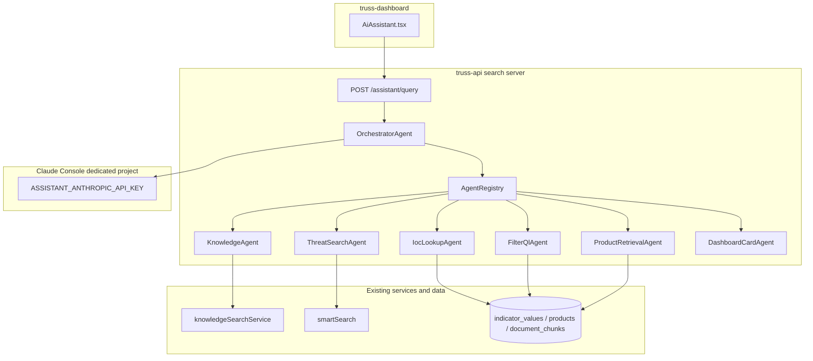

# Target architecture — MCP-inspired multi-agent assistant

## Principle

**The browser decides layout; the API decides intent and which agents run.**

The dashboard sends one question. A **central orchestrator agent** (Claude with tool use) selects and invokes **downstream agents**. Each downstream agent wraps existing Truss services or new focused capabilities.

## Topology

## MCP-inspired vs true MCP

| Aspect | This design | True MCP (e.g. truss-agent-mcp) |
|--------|-------------|----------------------------------|
| Transport | In-process function calls | stdio / HTTP MCP protocol |
| Host | truss-api Express search server | Cursor, Claude Desktop, etc. |
| Tool registry | TypeScript `AgentRegistry` | MCP `tools/list` |
| Auth | Truss API key via BFF | Customer `TRUSS_API_KEY` |
| Scope | Dashboard assistant + admin search routes | Public FilterQL tier |

**Rationale:** Fastest path; reuses `e/new-ai` deploy model; avoids N MCP server processes and cold starts.

## Orchestrator responsibilities

1. Read user `query` and optional `mode` override
2. When `mode === auto`: Claude tool-calling loop over registered agents
3. When `mode` is explicit: map mode → agent set (preserve current UX)
4. Execute agents (parallel when independent and within latency budget)
5. Merge `AgentResult` payloads into unified `AssistantQueryResponse`
6. On orchestrator failure: fall back to **regex router** (today's classifier)

## Downstream agent responsibilities

Each agent:

- Exposes a **tool definition** (name, description, JSON input schema) to the orchestrator
- Implements **one primary user intent** (see [03-agent-catalog.md](./03-agent-catalog.md))
- Returns typed **`AgentResult`** (success, data, error, durationMs)
- Uses **`callAssistantLLM`** only when synthesis/parsing is required (see [05-claude-key-and-observability.md](./05-claude-key-and-observability.md))

## What does not change

- Single dashboard entry: `POST /assistant/query`
- Separate retrieval backends: **product RAG** vs **document RAG** must not be merged in prompts
- E5 embeddings for vector search
- BFF pattern: no Claude keys in the browser bundle

## Routing tiers (from ai-orchestration.md)

| Tier | Mechanism | Target state |
|------|-----------|--------------|
| 1 — Rules | Regex classifier | **Fallback** after orchestrator failure |
| 2 — Orchestrator LLM | Claude tool use | **Primary** for `auto` mode |
| 3 — Light classifier | Small model / embedding intent | Future optimization |

## Latency and fan-out policy

- Avoid blind always-`both` — doubles cost and risks API Gateway ~29s limit
- Orchestrator selects **minimal** agent set
- Parallel execution only when legs are independent and time budget allows
- Skip knowledge leg when `document_chunks` empty → `meta.degraded`

## Security note

Orchestration is **routing policy**, not authorization. Callers with API keys can still hit `/search/smart` and `/knowledge/search` directly unless separately restricted.
