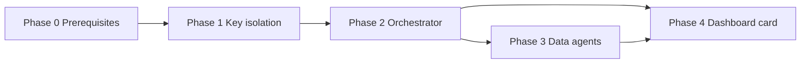

# Future implementation phases

**This section describes a likely build sequence for a separate implementation plan.** Nothing here is scheduled or in progress as part of the conceptualization doc package.

## Phase 0 — Prerequisites (before coding)

- [ ] Merge or deploy `truss-api` `e/new-ai` to target environment
- [ ] Run document ingest (`document_chunks` populated)
- [ ] Pin `truss-dashboard` → `truss-sdk-internal#e/new-ai`
- [ ] Create `ASSISTANT_ANTHROPIC_API_KEY` in Claude Console
- [ ] Resolve items in [10-open-questions.md](./10-open-questions.md)

## Phase 1 — Assistant key isolation

**Goal:** All assistant-path Claude calls use dedicated key.

- Add `ASSISTANT_ANTHROPIC_API_KEY`, `callAssistantLLM`, env docs
- Route knowledge/threat synthesis services through assistant key when called from `/assistant/query` tree
- Verify Claude Console separation

**Dashboard change:** None required.

## Phase 2 — Orchestrator + registry (two agents)

**Goal:** Replace regex for `auto` mode with Claude tool routing; keep fallback.

- `src/data/assistant/` module structure
- `knowledgeAgent`, `threatSearchAgent` wrap existing services
- `orchestratorAgent` + `callAssistantLLMWithTools`
- Extended `AssistantQueryResponse.meta` (`routed_by`, `agents_invoked`)
- Golden-question tests in `sdk-assistant.ts`

**Dashboard change:** Optional `meta` debug display.

## Phase 3 — New data agents

**Goal:** IOC, filter-only, structured product fetch.

- `iocLookupAgent` — indicator DB lookup
- `filterQlAgent` — parse without mandatory smart search
- `productRetrievalAgent`
- SDK types for new payloads
- Dashboard: FilterQL preview, IOC results, product list blocks

## Phase 4 — Dashboard card agent + polish

**Goal:** NL → chart suggestion with one-click add.

- `dashboardCardAgent` with `ChartType` enum in prompt
- `add_dashboard_card` suggested action
- Wire `useViewStore.addCard`
- Agent trace / degraded UX
- Render knowledge `suggested_actions`

## Phase 5 — Optimization (optional)

- Tier-2 light classifier before full orchestrator LLM
- Pass dashboard `context` (active filter) on each query
- Budgeted parallel fan-out policy tuning
- Route enum expansion (`filter_only`, etc.)

## Recommended first slice

**Phase 1 + Phase 2** with only `knowledge` and `threatSearch` agents proves orchestrator, dedicated key, and Console tracking before IOC/filter/card work.

## Dependencies between phases

Phase 4 can start after Phase 2 if dashboard card agent does not require IOC/filter agents (it may depend on `filterQl` for filter context).

## Repos touched (implementation reference)

| Repo | Phases |
|------|--------|
| truss-api | 1–4 |
| truss-sdk-internal | 2–4 |
| truss-dashboard | 2–4 (UI) |
| truss-agent-mcp | Docs only in conceptualization; optional future alignment notes |
